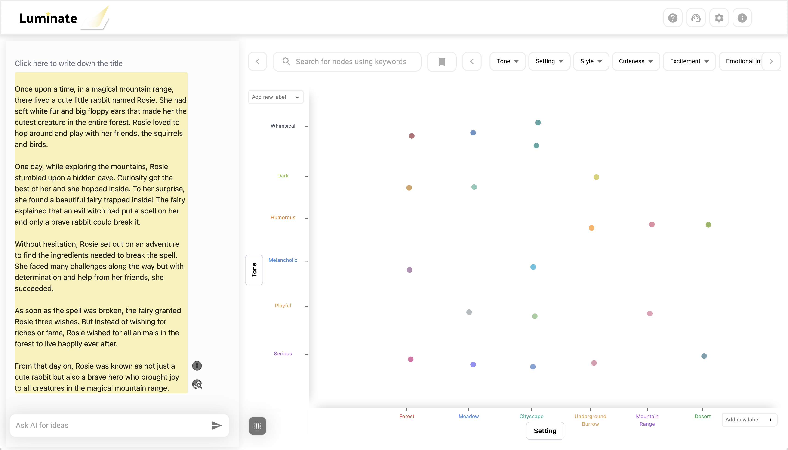

# Luminate: Structured Generation and Exploration of Design Space with Large Language Models for Human-AI Co-Creation

<p align="left">
</img>
</p>

Luminate is an interactive system that enables structured generation and exploration of LLM outputs.

For a quick overview, watch this <a href="https://youtu.be/_H8yt2OS7FE?si=UJ7hpb2B7yX4VfVJ" target="_blank">30-sec preview video</a>. 

For more details on the project, watch this <a href="https://youtu.be/CwVodmRuLds?si=qKHIbdtxWtICXCG8" target="_blank">6-min video</a> or read our <a href="https://arxiv.org/abs/2310.12953" target="_blank">paper</a>.

You can also visit this <a href="https://luminate-research.github.io/" target="_blank">project page</a>.

## Installation

If running for the first time, install dependencies (required: node.js v14.17.0):

`npm install`

To run server, write:

```
npm run dev
```

To use OpenAI API, 

1. create `.env` file at the root of the directory.
2. Add the following in `.env`:

   ```
   VITE_OPENAI_API_KEY = "{YOUR_OPENAI_API_KEY}"
   ```
3. Replace `{YOUR_OPENAI_API_KEY}` with your openAI API key


## CHI 2024 Paper

**Luminate: Structured Generation and Exploration of Design Space with Large Language Models for Human-AI Co-Creation**<br />
Sangho Suh\*, Meng Chen\*, Bryan Min, Toby Jia-Jun Li, Haijun Xia

**Please cite this paper if you used the code or prompts in this repository.**

> Sangho Suh, Meng Chen, Bryan Min, Toby Jia-Jun Li, and Haijun Xia. 2024. Luminate: Structured Generation and Exploration of Design Space with Large Language Models for Human-AI Co-Creation. In Proceedings of the CHI Conference on Human Factors in Computing Systems (CHI ’24), May 11–16, 2024, Honolulu, HI, USA. ACM, New York, NY, USA, 26 pages. https://dl.acm.org/doi/10.1145/3613904.3642400

## Bibtex
    
 ```bibtex
 @article{suh2023luminate,
   title = {Luminate: Structured Generation and Exploration of Design Space with Large Language Models for Human-AI Co-Creation},
   author = {Suh, Sangho and Chen, Meng and Min, Bryan and Li, Toby Jia-Jun and Xia, Haijun},
   booktitle = {Proceedings of the 2024 CHI Conference on Human Factors in Computing Systems},
   pages = {1--26},
   year = {2024},
   url = {https://doi.org/10.1145/3613904.3642400},
   doi = {10.1145/3613904.3642400}
 }
 ```

